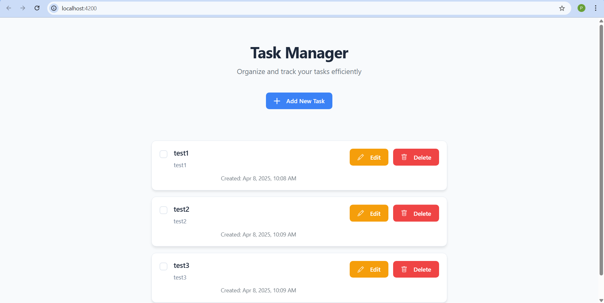
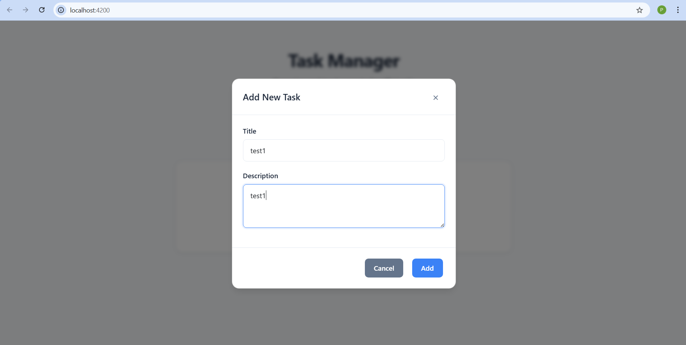
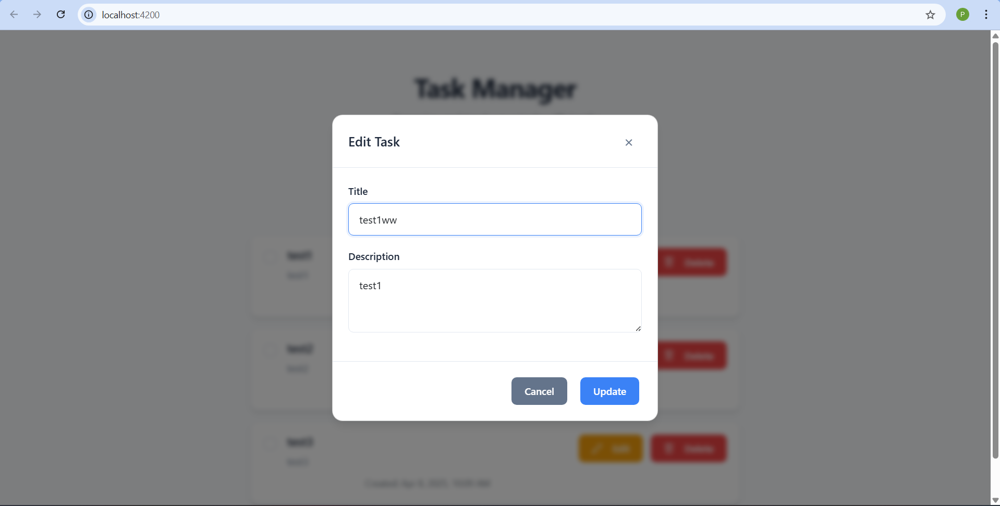

# Task Manager Application

A full-stack task management application built with Spring Boot backend and Angular frontend. The application allows users to create, read, update, and delete tasks with a modern, responsive user interface.

## Features

- Create new tasks with title and description
- Mark tasks as completed
- Edit existing tasks
- Delete tasks
- Persistent storage using MySQL database
- Responsive design for mobile and desktop

## Screenshots

### Task List View


_Main dashboard showing all tasks with their status_

### Add New Task


_Modal form for creating a new task_

### Edit Task


_Editing an existing task with current details_

## Tech Stack

### Backend

- Java 17
- Spring Boot 3.1.5
- Spring Data JPA
- MySQL Database
- Maven for dependency management

### Frontend

- Angular 17
- TypeScript
- Bootstrap CSS
- HTML5 & CSS3

## Prerequisites

Before running this application, make sure you have the following installed:

- Java Development Kit (JDK) 17 or later
- Node.js and npm (Node Package Manager)
- MySQL Server
- Maven
- Angular CLI

## Getting Started

### Database Setup

1. Install MySQL if not already installed
2. Create a database named `taskmanagerdb`:

```sql
CREATE DATABASE taskmanagerdb;
```

### Backend Setup

1. Navigate to the backend directory:

```bash
cd backend
```

2. Configure database connection in `src/main/resources/application.properties`:

```properties
spring.datasource.url=jdbc:mysql://localhost:3306/taskmanagerdb
spring.datasource.username=root
spring.datasource.password=your_password
```

3. Build and run the Spring Boot application:

```bash
mvn spring-boot:run
```

The backend server will start on http://localhost:8080

### Frontend Setup

1. Navigate to the frontend directory:

```bash
cd frontend
```

2. Install dependencies:

```bash
npm install
```

3. Start the Angular development server:

```bash
ng serve
```

The frontend application will be available at http://localhost:4200

## API Endpoints

The backend provides the following REST endpoints:

- GET `/api/tasks` - Get all tasks
- GET `/api/tasks/{id}` - Get a specific task
- POST `/api/tasks` - Create a new task
- PUT `/api/tasks/{id}` - Update an existing task
- DELETE `/api/tasks/{id}` - Delete a task

## Project Structure

### Backend

```
backend/
├── src/main/java/com/taskmanager/
│   ├── controller/
│   │   ├── TaskController.java
│   │   └── TestController.java
│   ├── model/
│   │   └── Task.java
│   ├── repository/
│   │   └── TaskRepository.java
│   └── TaskManagerApplication.java
└── src/main/resources/
    └── application.properties
```

### Frontend

```
frontend/
├── src/
│   ├── app/
│   │   ├── components/
│   │   │   ├── task-form-modal/
│   │   │   └── task-list/
│   │   ├── models/
│   │   │   └── task.ts
│   │   └── services/
│   │       └── task.service.ts
│   ├── styles.css
│   └── index.html
└── package.json
```

## Contributing

1. Fork the repository
2. Create your feature branch (`git checkout -b feature/AmazingFeature`)
3. Commit your changes (`git commit -m 'Add some AmazingFeature'`)
4. Push to the branch (`git push origin feature/AmazingFeature`)
5. Open a Pull Request

## License

This project is licensed under the MIT License - see the LICENSE file for details.
